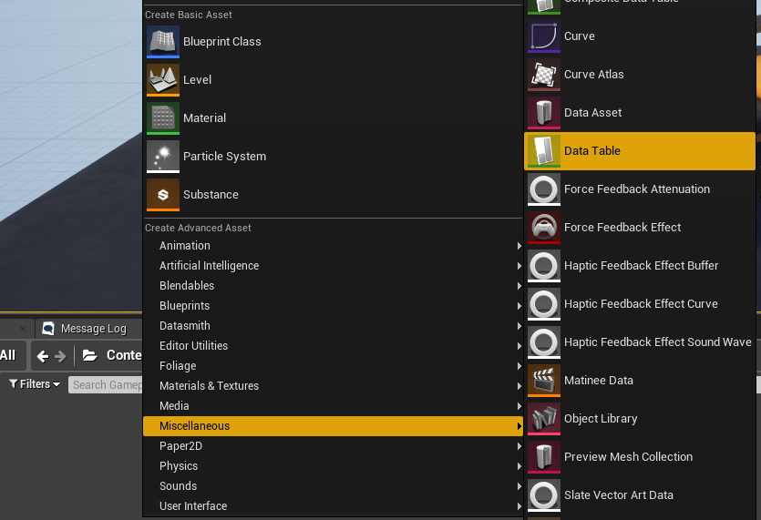
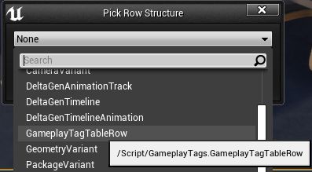
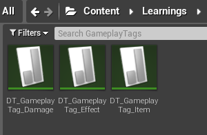
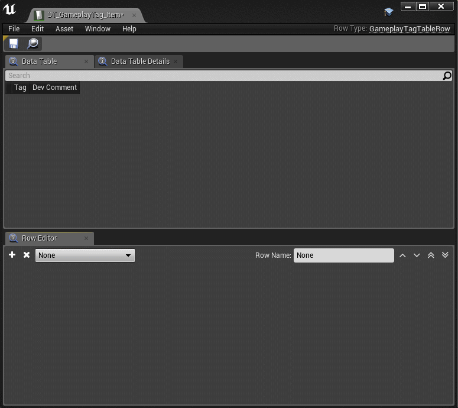
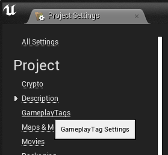
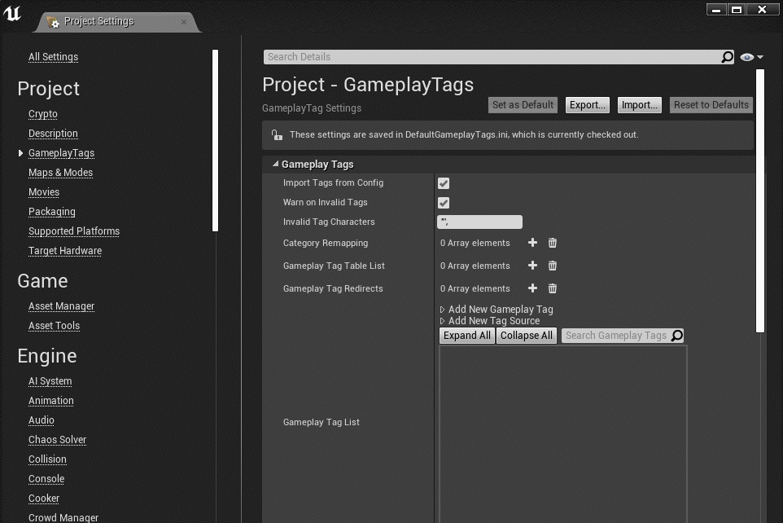
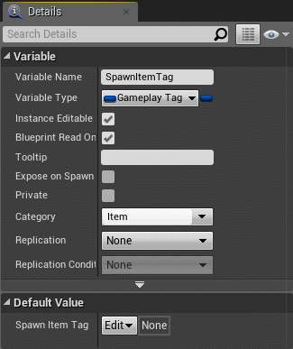
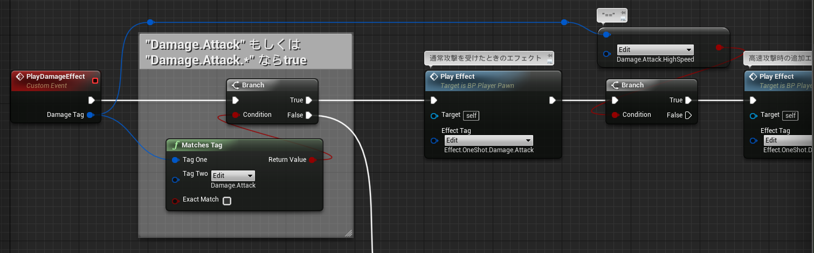

# GameplayTag: まずはざっくり見てみる

> [UE4 GameplayTag Advent Calendar 2019 1日目](https://qiita.com/advent-calendar/2019/ue4-gameplaytag)  
>#UE4Study #UE4.23 #UnrealEngine #GameplayTag

## これはなに？

* UE4 の GameplayTag について、一人 AdventCalendar です。
    * 自分が公私プロジェクトで GameplayTag を使う際、気になってたことを、25日に分けてまとめます。
    * プロジェクトの様々な職種の人が使うもの、という前提で書いています。
    * Blueprint メインです。C++ については、必要と思ったところで触れます。
* ツッコミなどありましたら、twitterのリンク付きツイートなどあれば、そのうち気づくかも。
    * もしくは、[issueを立てていただいても](https://github.com/tokeisoh/inks.blue/issues)。

## まずは、GameplayTag について、ざっくり見てみる

* 今回は、ざっとイメージを掴むための、ごくごくごくシンプルなスクリーンショットを並べてみる。

### プロジェクトで使うタグたちを用意する

* ContentBrowser から、タグを定義する DataTable を作成する。  

* Structureは `GameplayTagTableRow` を選ぶ。  

* タグは複数の DataTable に分かれていてもよい。今回は3つ作ってみる。  

* それぞれ、タグを定義する。  

### タグたちをプロジェクトに登録する

* ProjectSettings の `GameplayTags` セクションを選択。  

* `Gameplay Tag Table List` に、作成した DataTable たちを追加する。

### GameplayTagを使ってみる

* ItemSpawner がスポーンするアイテムの種類を、GameplayTag 型プロパティで選べるようにする。  

* ダメージの種類で処理を変える。階層化された `Damage.Attack` グループだけを判別することもできる。  

## これだけ？

* いえいえ、もっとできることはたくさん。
* メリットいろいろ、デメリットもいろいろ。
* 残り24記事でも書き切れないくらい。
* だいたい分かって、それなりに使ってきたけど、「あれっ？ここどうなってたっけ？」「これどうしよう？」ってなったところがいろいろあったので、残りの記事でまとめていきます。

## 次回予告

* 02日目: `タグと言えば: ActorTag, ComponentTagとの違い(準備中)`

----

> [UE4 GameplayTag Advent Calendar 2019(Qiita)](https://qiita.com/advent-calendar/2019/ue4-gameplaytag)  
> [inks.blue / UE4 GameplayTag Advent Calendar 2019](./Index.md)  
> [inks.blue](../../Index.md)
