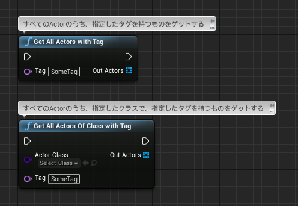
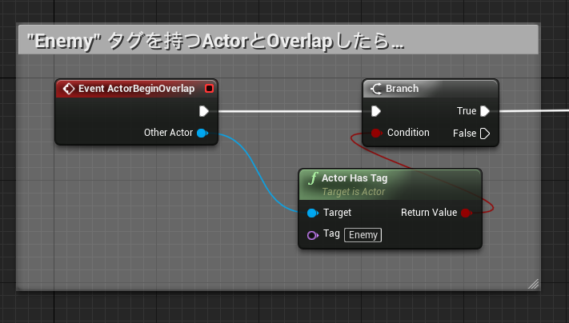

# タグといえば: Actor Tags, Component Tags との違い

> [UE4 GameplayTag Advent Calendar 2019 2日目](https://qiita.com/advent-calendar/2019/ue4-gameplaytag)  
>#UE4Study #UE4.23 #UnrealEngine #GameplayTag

## Actor Tags, Component Tags ってなに？

* Actor Tags とは、Actor が最初から持っている、`Tags` プロパティのこと。
* Component Tags とは、ActorComponent が最初から持っている、 `Tags` プロパティのこと。
* どちらも、Name 型の配列です。

## どうつかうの？

* `Get All Actors With Tag`  

* `Actor Has Tag`  

* 同様の `Get Components By Tag`, `Component Has Tag` なんかもあるよ。

## GameplayTag とはどう違うの？

* Actor Tags, Component Tags は、Name 型配列のプロパティ。
    * 使用するタグを、別途定義する必要がない。
    * Name 型なので、都度、手打ちする必要がある。スペルミスに注意が必要。
    * 1つの Actor や ActorComponent に、`Tags` という1つのプロパティがあるだけ。拡張できない。
* GameplayTag は、型の種類そのもの。
    * 使用するタグを、予め定義する必要がある。
    * エディタ上では、常に専用UI上からチェックするだけなので、スペルミスの心配がない。
    * 検索フィルタで素早く選べるのも嬉しい。
    * 1つの Actor や ActorComponent に、任意の名前の GameplayTag 型のプロパティを、いくつでも持てる。
    * GameplayTag では、階層つきのタグを表現できる。

## どう使い分けよう

* Actor Tags, Component Tagsは、 `Actor Has Tag` や ` Get All Actors With Tag` といった機能を、「追加実装なしに」使えるのが大きなメリット。
    * 特に、プロトタイプやテスト、比較的限定的な使い方なら、これでも十分では。
* 階層つきのタグを使いたいなら、GameplayTag ほぼ一択。
* どういうタグが存在するか、管理したくなってきたら GameplayTag にしたいなあ。

## 次回予告

* 03日目: じゃあ、enum とはどう違うの？どう使い分けよう？(準備中)

---

> [UE4 GameplayTag Advent Calendar 2019(Qiita)](https://qiita.com/advent-calendar/2019/ue4-gameplaytag)  
> [inks.blue > UE4 GameplayTag Advent Calendar 2019](./Index.md)  
> [inks.blue](../../)

(C) 2019 inks.blue
