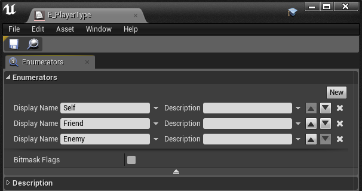
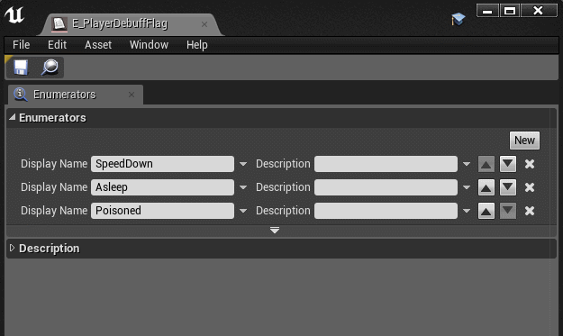
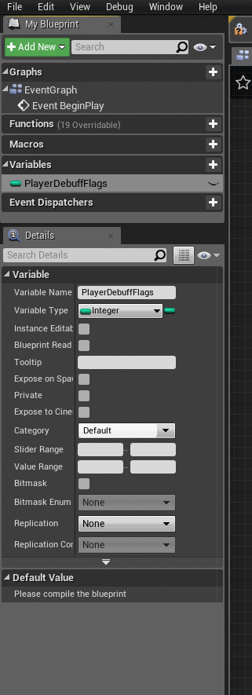

# じゃあ、enum とはどう違うの？どう使い分けよう？

> [UE4 GameplayTag Advent Calendar 2019 3日目](https://qiita.com/advent-calendar/2019/ue4-gameplaytag)  
>#UE4Study #UE4.23 #UnrealEngine #GameplayTag

## enum と bitflag

* enum (列挙型)とは、名前付き定数の集まりを表す、ユーザー定義型。
* 例えば、以下の `E_PlayerType` 型のような、3種類の名前(=定数)だけを扱う型を定義することができる。  

* ここでは、名前しか見えないが、内部ではそれぞれが数値(0, 1, 2, 3, 4, …)として扱われる。
* また、enum には bitflag という表現もあり、複数の定数の足し合わせによって複数の状態を1つの変数で表現できる。  
  

* 例えば、↑ `E_PlayerDebuffFlag` 型のような、「眠り かつ 毒」といった状態を表現できる。
    * この場合、内部の数値が、それぞれ2の累乗(~~0,~~ 1, 2, 4, 8, …)で扱われる。

## GameplayTag とはどう違うの？

* enum は、ユーザー定義型。定義した型それぞれが別の型になる。
    * 異なる型の値は、そのままでは変数に代入できない。
    * 異なる型の値は、選択肢に出てこない。
* enum は、Blueprint、C++ どちらでも定義できる。
    * C++ で定義して Blueprint に公開しなければ、C++でのみ使用する enum を定義できる。
    * Blueprint 上で定義した enum は、C++ からは参照できない。
* enum は、1つの型で定義できるメンバ数が限られる。
    * 通常の enum なら、256個(かな？ uint8 だから)、bitflag なら、32個まで。
* GameplayTag は、すべてのタグが GameplayTag 型 の値として扱われる。
    * その変数にまったく関係のないタグでも、代入できてしまう。選択肢の候補に出てきてしまう。
    * 登録したタグは、Blueprint でも C++ でも使える。バインド作業が必要ない。

## どう使い分けよう

* 変数に代入できる値を厳密に管理したいなら、enum が便利。
    * とりわけ、「ゲーム特有のアセット」でないようなもの。ゲームの仕様に大きくは左右されないもの。
    * 「キー入力の種類」とか「アルゴリズムの種類」とかは、 enum が自然になる箇所が多いのでは。
* 増やしてもいちいちコンパイルしたくないようなもの、アセット的なものは、GameplayTag の方が向いてそう。
* 階層つきのタグを使いたいなら、GameplayTag だけど、↑ の方が優先かなあという気持ち。
* なお、GameplayTag で、bitflag のようなことをするには、GameplayTagContainer が使える。

## 次回予告

* [04日目: 使用するタグをプロジェクトへ登録する](./Day04-AddTagsToProject.md)

---

> [UE4 GameplayTag Advent Calendar 2019(Qiita)](https://qiita.com/advent-calendar/2019/ue4-gameplaytag)  
> [inks.blue > UE4 GameplayTag Advent Calendar 2019](./Index.md)  
> [inks.blue](../../)

(C) 2019 inks.blue
