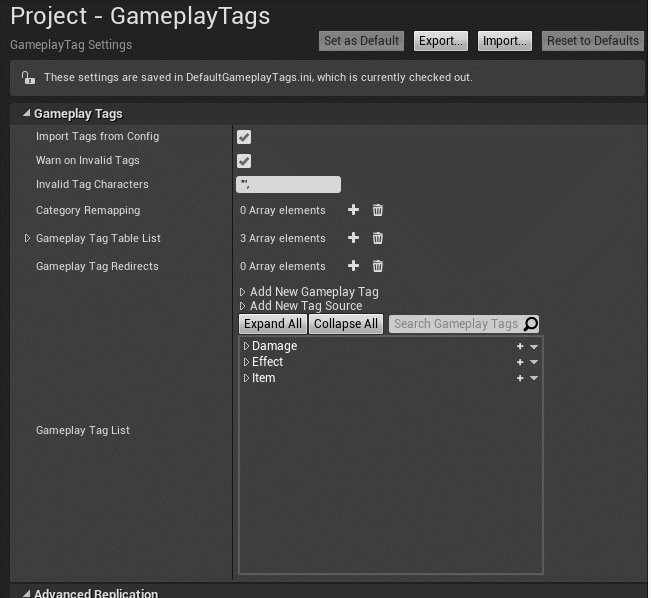
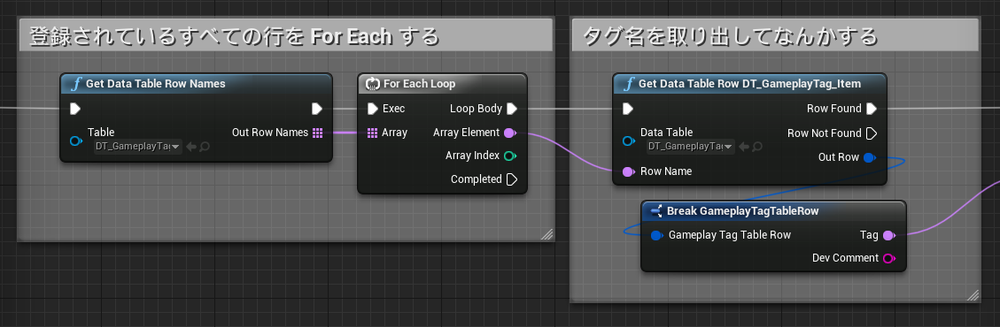

# 使用するタグをプロジェクトへ登録する

> [UE4 GameplayTag Advent Calendar 2019 4日目](https://qiita.com/advent-calendar/2019/ue4-gameplaytag)  
>#UE4Study #UE4.23 #UnrealEngine #GameplayTag

## タグの定義とプロジェクトへの登録

* プロジェクトで GameplayTag のタグを使えるようにするには、「タグの定義」と「定義したタグのプロジェクトへの登録」が必要。
* [01日目の記事](./Day01-Overview.md)のように、タグを定義する DataTable を作ってプロジェクトへ登録するのは、その方法のうちの1つ。
* それとは別に、プロジェクト設定上で直接定義する方法がある。
* プロジェクト設定上で直接定義する場合、タグ情報は以下のいずれかの .ini ファイルに保存される。
    * `/Config/DefaultGameplayTags.ini`
    * `/Config/Tags` 以下の .ini ファイル。

## プロジェクト設定上で直接定義するには

* ProjectSettings の GameplayTags セクションを選択。
* Import Tags from Config のチェックを ON にしておく。
* Gameplay Tag List の、Add New Gameplay Tag を開き、タグを追加する .ini を選択して、タグを追加する。  
タグを追加する先の .ini (Tag Source) を別途追加するには、Add New Tag Source から行う。  

## DataTable で定義して、プロジェクト設定へ登録するには

* [01日目の記事](./Day01-Overview.md)を参照してね。

## どう違うの？

* DataTable の場合は、DataTable の編集 UI の他に、CSV や JSON からインポートする方法が使える。
    * 特に CSV はみんなだいすき Excel 上で編集できるよ。
* DataTable では、定義しているタグたちを DataTableRow として取り出すことができる。
    * 特定の DataTable に登録されているすべてのタグを走査して、なにか処理を行うことが可能。  
    * ただし、ここで取り出せるのは Name 型のタグ名。GameplayTag 型にするには、文字列型からの変換が必要。  
    (15日目くらいの記事を参照してね。)  
    
* プロジェクト設定上で直接定義する場合、削除やタグ名変更もプロジェクト設定上で行う。
    * タグ名の右にある、「▼」をクリックして、でてきたコンテキストメニュー上から行う。
    * このコンテキストメニュー上でタグ名を変更すると、タグを使用している箇所もその場で書き換えてくれる。らしい。  
    (20日目くらいの記事を参照してね。)

## 次回予告

* 05日目: タグの定義と登録、こうするとどうなるの？

---

> [UE4 GameplayTag Advent Calendar 2019(Qiita)](https://qiita.com/advent-calendar/2019/ue4-gameplaytag)  
> [inks.blue > UE4 GameplayTag Advent Calendar 2019](./Index.md)  
> [inks.blue](../../)

(C) 2019 inks.blue
