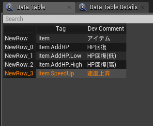
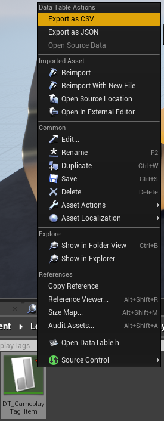
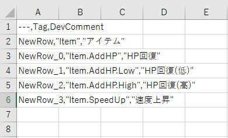
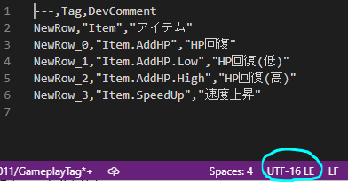
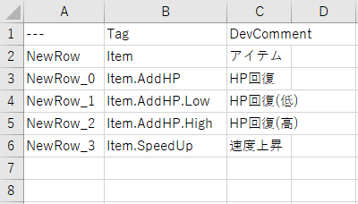
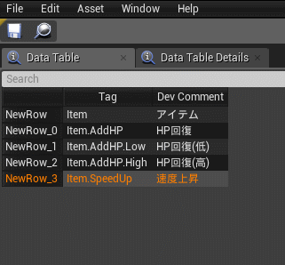
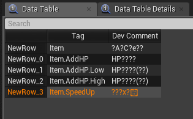
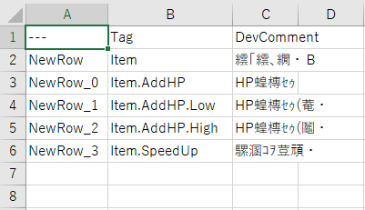
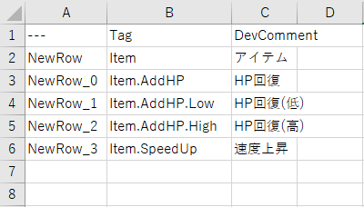
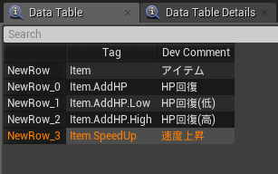

# タグを CSV で管理する

> [UE4 GameplayTag Advent Calendar 2019 5日目](https://qiita.com/advent-calendar/2019/ue4-gameplaytag)  
>#UE4Study #UE4.23 #UnrealEngine #GameplayTag

## タグの DataTable を CSV で管理する

* DataTable は、CSV からインポートすることができる。
* 当然、タグの DataTable も、CSV からインポートできる。
* みんなだいすき Excel で都度編集し、再インポートできる。
* しかし、そこにはちょっとした落とし穴がいくつか。

## DataTable から CSV にエクスポートする

* ざっと DataTable で作ってたけど、そろそろ Excel で管理したくなってきたなー。
* そうだ、タグが増えて訳分からなくなる前に、コメントつけておこう。 **日本語で。**  

* よし、じゃあ CSV にエクスポートしてみよう。
* コンテンツブラウザで DataTable を右クリック、Export as CSV で、CSV ファイルに保存。  

## Excel で CSV 開きたいだけなのに

* では早速、Excel で開いてみよう。どん。  

* えっ…ただのカンマ区切り文字列？CSV になってない？どういうこと？
* VSCodeで開いてみるか…。  

* UTF-16LE…これがあかんのかな？とりあえず、Shift_JIS あたりにしてみよう。  

* おお、ちゃんと区切られた！よし、じゃあUE4でインポートしてみよう！

## UE4 で CSV インポートしたいだけなのに

* DataTable の Asset メニューから、Reimport なんちゃらをクリック。  
  
* どん。  

* Oh...
* インポートする CSV ファイルを Excel で開きっぱなしだとこうなる。
    * __→ UE4.24 から、Excel で開きっぱなしの CSV もエラーなくインポートできるようになりました！__
* というわけで、Excel をいったん閉じて、気を取り直してもう一回！  

* Oh...

## UTF-8 BOM にすれば OK.

* UTF-8 BOM なしにすると、インポートは OK だが、Excel がこうなる。かなしい。  

* UTF-8 BOM ありにしましょう。  
  

* めでたしめでたし。

## 次回予告

* [06日目: タグを JSON で管理する](./Day06-ManageDataTableWithJSON.md)

---

> [UE4 GameplayTag Advent Calendar 2019(Qiita)](https://qiita.com/advent-calendar/2019/ue4-gameplaytag)  
> [inks.blue > UE4 GameplayTag Advent Calendar 2019](./Index.md)  
> [inks.blue](../../)

(C) 2019 inks.blue
