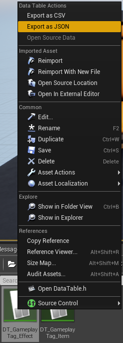
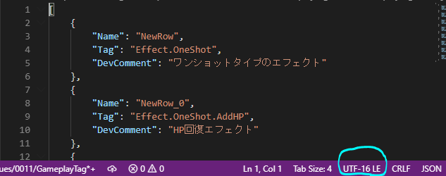
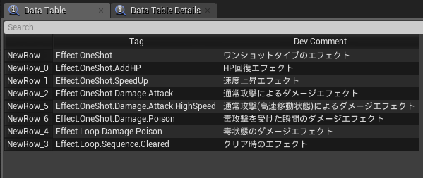

# タグを JSON で管理する

> [UE4 GameplayTag Advent Calendar 2019 6日目](https://qiita.com/advent-calendar/2019/ue4-gameplaytag)  
>#UE4Study #UE4.23 #UnrealEngine #GameplayTag

## DataTable から JSON にエクスポートする

* DataTable は、JSON からもインポートすることができる。
* 今回も、 **日本語でコメントつけて、** JSON にエクスポートしてみよう。
* コンテンツブラウザで DataTable を右クリック、Export as JSON で、JSON ファイルに保存。  

## JSON だとどうなる？

* さて、今度はどうなってるかなー。  

* あれっやっぱり UTF-16 LE なの？
* JSON って確か、BOM なし UTF-8 縛りじゃなかったっけ…って思って調べてみた。
* [→ 閉じたエコシステムでなければ、UTF-8 で。ネットワーク送信される JSON は、BOM なし。](https://tools.ietf.org/html/rfc8259)
* ふむ。ネットワーク送信するわけではないけど、試しに UTF-8 BOM なしにしてインポートしてみよう。  

* CSV のときと同様、問題なさそう。

## JSON での管理ってどんなときに使うだろう

* 他ツールからのエクスポートだろうか？エフェクトのリストとか、SE のリストとか。
* エクスポートするだけなら、CSV でも .ini でもいいような気はする。
* 最近だと標準で JSON 対応してる言語は多そうなので、連携はしやすいかも。
* Web 上で直接リスト編集して、JSON で吐く、なんて開発パターンもあったりするかな？

## 次回予告

* 07日目: タグの定義と登録、こうするとどうなるの？

---

> [UE4 GameplayTag Advent Calendar 2019(Qiita)](https://qiita.com/advent-calendar/2019/ue4-gameplaytag)  
> [inks.blue > UE4 GameplayTag Advent Calendar 2019](./Index.md)  
> [inks.blue](../../)

(C) 2019 inks.blue
