# タグの定義と登録、こうするとどうなるの？

> [UE4 GameplayTag Advent Calendar 2019 7日目](https://qiita.com/advent-calendar/2019/ue4-gameplaytag)  
>#UE4Study #UE4.23 #UnrealEngine #GameplayTag

## GameplayTag の登録

* GameplayTag の登録方法、割と緩い。
    * 定義や登録しただけでは、コンパイルが走ったりしない。
    * 特に関連のない、.ini や DataTable を、複数、プロジェクトに登録して使える。
    * 階層の表現は、タグ文字列上で "." で区切るだけ。
    * DataTable は、GameplayTag に特化した UI を持っているわけではない。
* なんか問題がある登録状態にもできそうな気がするけど、実際やったらどうなるのか知りたい。
* いや、さほど大きな問題にもなることもないような。でもちょっと気になる。
* そんな興味本位メインで、 本日の記事はお送りいたします。

## 階層化タグの、親タグを定義しなかったらどうなるの？

* そういえば、Effect の DataTable に、"Effect" っていうタグ登録してなかったな。
* UI 上でも普通に Effect から開いていけるし、単独でチェックもできるし、特に問題なさそうですよねー。  
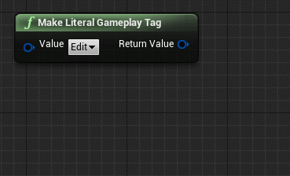
* あっ DevComment が、"Effect.OneShot" のやつだ！
* 初めて定義された "Effect" を含むタグ "Effect.OneShot" の DevComment が使われるよってことかなー。
* ソートされると "Effect.Loop" が先だけど、DataTable 上での定義は "Effect.OneShot" が先だったからな。

## 同じタグを複数定義しちゃったらどうなるの？

* DT_GameplayTag_Item をコピーして、Project Settings に登録してみよー。  
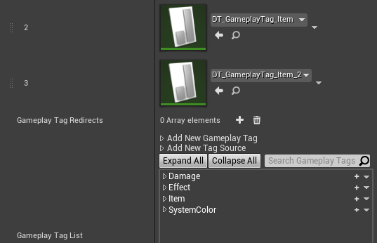
* うん、重複はスルーされるのね。
* ちなみにタグ名は Name 型なので、大文字小文字の違いも無視される。

## 記号って使えるの？

* そういえば、Project Settings のところに、`Invalid Tag Characters` っていうのがあったな。
* デフォルトだと、シングル＆ダブルクォーテーションとカンマだけ "Invalid" なのかな？それ以外ならいけるのかな？  
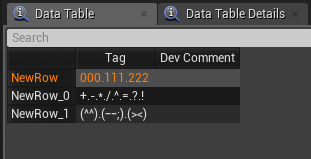  
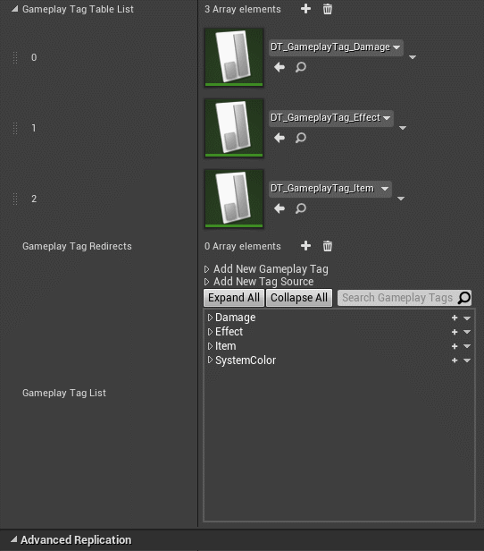
* おお…普通にいけた。

## 日本語のタグって使えるの？

* いけそうな気もするけど、そういえば使ったことなかったな。  
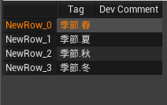  
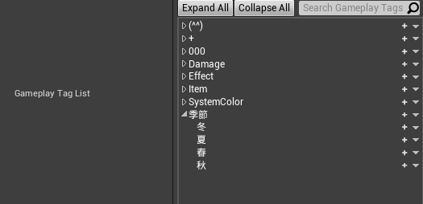
* あっでもソートが思ってたのと違う。これは文字コード上の順番とかなのかな…？ふむ。

## ちょっとまって、クォーテーションとカンマもいけるの？

* 思い出した。 `Invalid Tag Characters` デフォルト値でクォーテーションとカンマ入ってるけど、この設定、消せるよね？
* クォーテーションとカンマも大丈夫なん？  
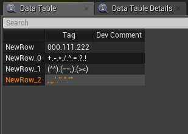  
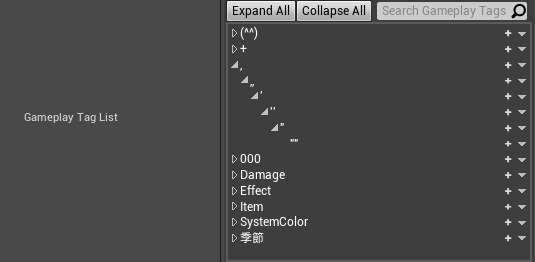
* お、おう…いけるのね。基本的に、"." を階層化用に区別して、それ以外は単に文字として見てるだけなのかな。
* クォーテーションとカンマ、ぱっと思いつく不都合としては、…エクスポート？
* JSON はダブルクォーテーションをエスケープして終わりだろうけど、CSV はどうなる？  
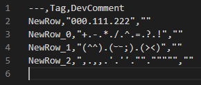
* あ、そんな感じで大丈夫なん…そういえば CSV でこういう文字列扱ったことないなあ。ダブルクォートか。
* Excel は大丈夫なんだろうか。UTF-8 BOM 化して開いて…  
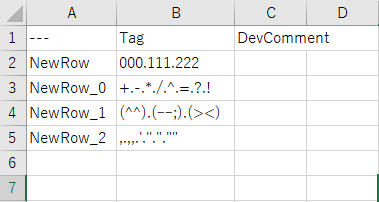
* これでいいんだ…ほほー。

## 使ってみたけど、やっぱ Invalid にするわ！

* そういえば調べてなかった。禁止されてる文字が入ってるタグはどういう扱いになるの？
* クォーテーションとカンマを禁止に戻す。  
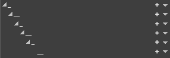
* "_" に変換されるのかー。

## あ。スペースは…

* これまでの感じだと、他の文字の間にスペースが入る分には大丈夫そう。
* スペースだけだとどうなるかな…恐る恐る "&nbsp;.&nbsp;&nbsp;.&nbsp;&nbsp;&nbsp;.&nbsp;&nbsp;&nbsp;&nbsp;" というタグを入れてみる。  
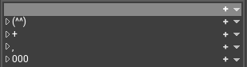
* ！ 階層開くやつ "▷" がない！なんかエラーでてる！  
"LogGameplayTags: Error: Invalid tag .&nbsp;&nbsp;.&nbsp;&nbsp;&nbsp;.&nbsp;&nbsp;&nbsp;&nbsp; from source /(中略)/DT_GameplayTag_VariousCharacters: Tag ends with space! Replacing with .&nbsp;&nbsp;.&nbsp;&nbsp;&nbsp;., you may need to modify InvalidTagCharacters"
* スペースで終わるタグはアウトなのか。でも ".&nbsp;&nbsp;.&nbsp;&nbsp;&nbsp;.&nbsp;&nbsp;&nbsp;&nbsp;" が ".&nbsp;&nbsp;.&nbsp;&nbsp;&nbsp;." って、中間のタグは許されてるな…
* あれっ先頭のスペースどこ行った！？  
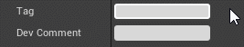
* 先頭のスペース、消されてる！末尾のは消されないな。
* これは Name 型の仕様かな？それとも、Name 型変数の入力 UI の…いや、これ以上は蛇足過ぎる。別で調べよう…
* そもそも、タグで先頭にスペース入れないといけないことなんてまずないだろうけど。

## 次回予告

* 08日目: GameplayTag と GameplayTag を比較する

---

> [UE4 GameplayTag Advent Calendar 2019(Qiita)](https://qiita.com/advent-calendar/2019/ue4-gameplaytag)  
> [inks.blue > UE4 GameplayTag Advent Calendar 2019](./Index.md)  
> [inks.blue](../../)

(C) 2019 inks.blue
