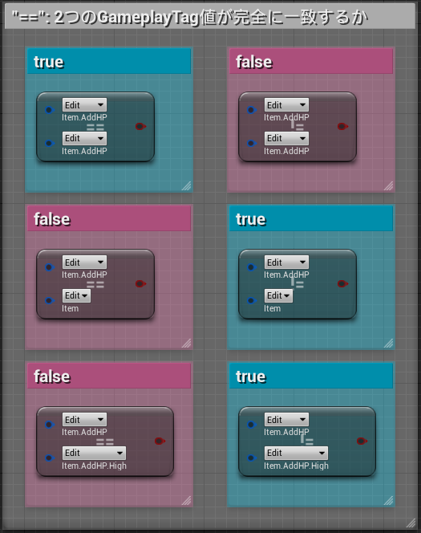
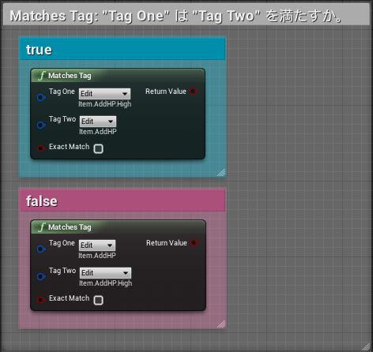
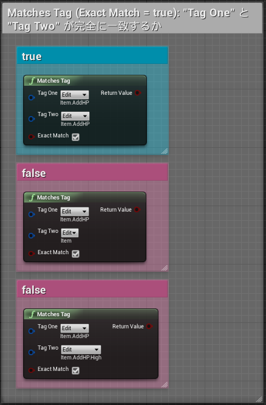

# 08日目: GameplayTag と GameplayTag を比較する

> [UE4 GameplayTag Advent Calendar 2019 8日目](https://qiita.com/advent-calendar/2019/ue4-gameplaytag)  
>#UE4Study #UE4.23 #UnrealEngine #GameplayTag

## ==, !=

* タグが完全一致するかどうかを調べる。記号から推測したままの結果が得られる。  

## MatchesTag

* `Tag One` は `Tag Two` を「満たす」かを調べる。  
* すなわち、`Tag One` が `Tag Two` そのもの or `Tag Two` の子孫タグなら、`true` になる。

* 引数名が "One", "Two" なので、ぱっとみ可換かと思ったら全然違った。
* 結局エンジンソース見に行ってようやく理解したのであった…

## MatchesTag (Exact Match == true)

* MatchesTag ノードで、Exact Match チェックを true にする。
* `==` と全く同じ結果になる。ので、`==` を使った方がシンプルかな？  

## 次回予告

* [09日目: GameplayTagContainer に含まれる GameplayTag を調べる](.Day09-GameplayTagContainerHasTag.md)

---

> [UE4 GameplayTag Advent Calendar 2019(Qiita)](https://qiita.com/advent-calendar/2019/ue4-gameplaytag)  
> [inks.blue > UE4 GameplayTag Advent Calendar 2019](./Index.md)  
> [inks.blue](../../)

(C) 2019 inks.blue
