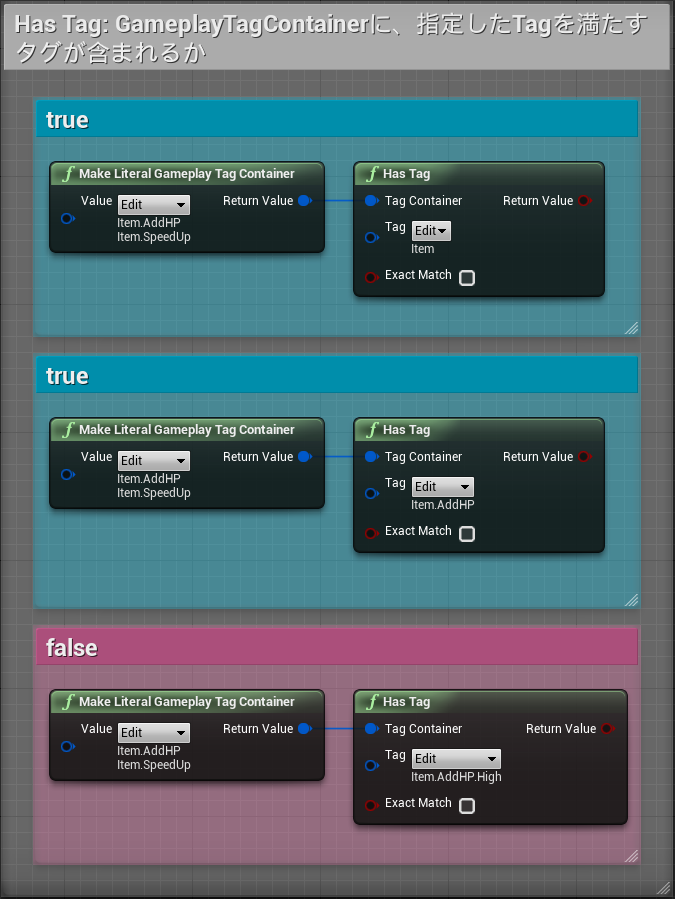
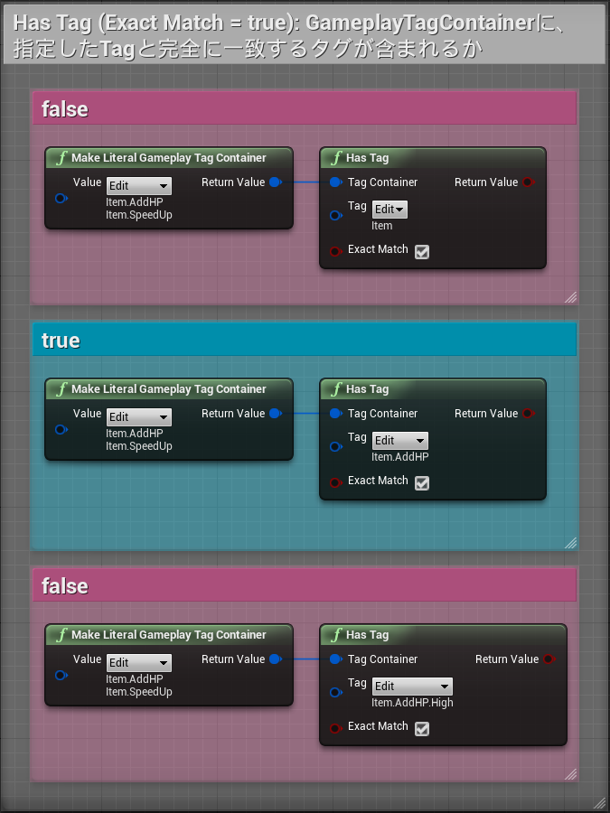

# 09日目: GameplayTagContainer に含まれる GameplayTag を調べる

> [UE4 GameplayTag Advent Calendar 2019 9日目](https://qiita.com/advent-calendar/2019/ue4-gameplaytag)  
>#UE4Study #UE4.23 #UnrealEngine #GameplayTag

## GameplayTagContainer とは

* GameplayTag を複数保持することができる変数型。
* GameplayTagContainer に対して、さまざまなやり方で、どのような GameplayTag が含まれているかを調べることができる。
* ややこしいので、焦らず小出しにご紹介。

## HasTag

* GameplayTagContainer が、`Tag` を満たすタグを保持しているか。
* すなわち、`Tag` そのもの or `Tag` の子孫であるタグを、GameplayTagContainerが保持しているなら、`true` になる。  

## HasTag (Exact Match == true)

* GameplayTagContainer が、`Tag` と完全一致するタグを保持しているか。  

## 次回予告

* 10日目: GameplayTagContainer と GameplayTagContainer を比較する

---

> [UE4 GameplayTag Advent Calendar 2019(Qiita)](https://qiita.com/advent-calendar/2019/ue4-gameplaytag)  
> [inks.blue > UE4 GameplayTag Advent Calendar 2019](./Index.md)  
> [inks.blue](../../)

(C) 2019 inks.blue
