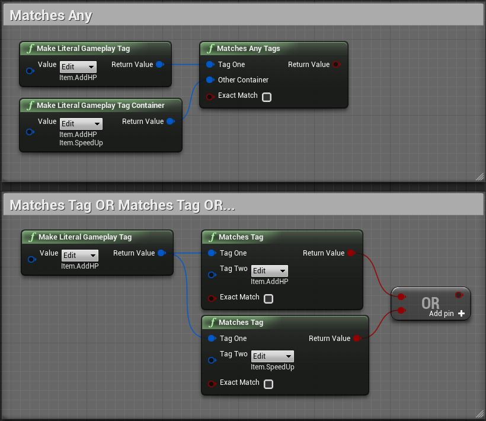
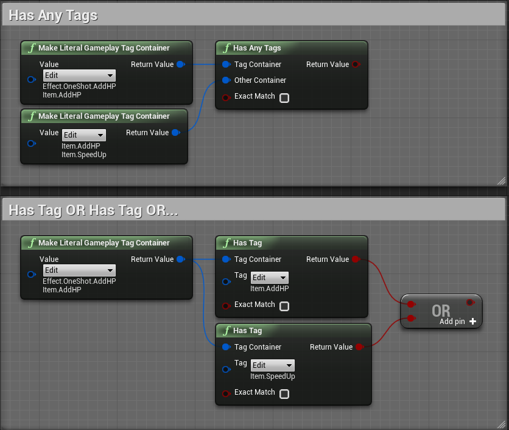
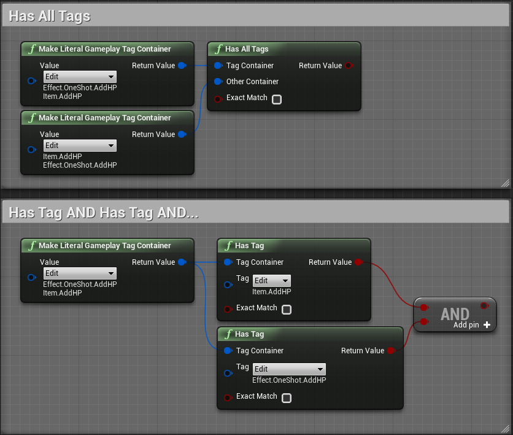

# 10日目: もっと GameplayTag、GameplayTagContainer を調べる

> [UE4 GameplayTag Advent Calendar 2019 10日目](https://qiita.com/advent-calendar/2019/ue4-gameplaytag)  
>#UE4Study #UE4.23 #UnrealEngine #GameplayTag

## ほかにもいろんなノードがあるんだけど…

* Matches Any とか、Has Any とか、似たような名前のノードがいろいろあって混乱する。
* 概念としては、これらは [8日目](./Day08-CompareGameplayTags.md) や [9日目](./Day09-GameplayTagContainerHasTag.md) に紹介した、基本的なノードで置き換えることができるもの。
* 以下の原則を思い出せれば、使い方に迷わずにすむ、かもしれない。
    * いずれも、1つ目の引数が、2つ目の引数の条件を満たすかを調べる。
    * 1つめの引数については、`Exact Match` が `false` の場合、2つ目の引数の子孫である場合も条件を満たすことになる。
    * つまり、1つ目の引数と2つめの引数は、立場的に交換可能ではない。

## Matches Any: Matches Tag OR Matches Tag OR...

* Matches Any は、Matches Tag を複数並べて、いずれかが `true` なら `true` になる。  

## Has Any: Has Tag OR Has Tag OR...

* Has Any は、Has Tag を複数並べて、いずれかが `true` なら `true` になる。  

## Has All: Has Tag AND Has Tag AND...

* Has All は、Has Tag を複数並べて、いずれも `true` なら `true` になる。  

## 次回予告

* 11日目: GameplayTagQuery で GameplayTagContainer を調べる

---

> [UE4 GameplayTag Advent Calendar 2019(Qiita)](https://qiita.com/advent-calendar/2019/ue4-gameplaytag)  
> [inks.blue > UE4 GameplayTag Advent Calendar 2019](./Index.md)  
> [inks.blue](../../)

(C) 2019 inks.blue
