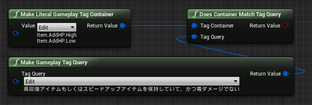
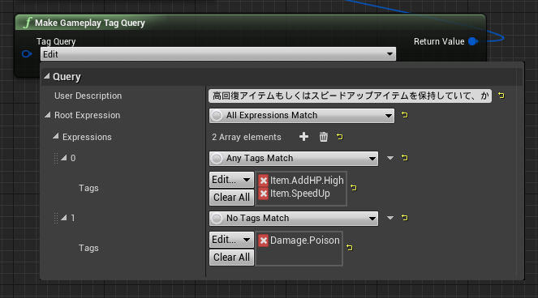
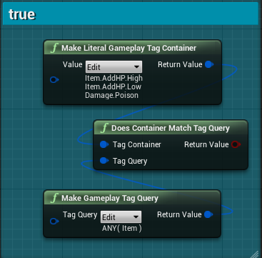

# 11日目: GameplayTagQuery で GameplayTagContainer を調べる

> [UE4 GameplayTag Advent Calendar 2019 11日目](https://qiita.com/advent-calendar/2019/ue4-gameplaytag)  
>#UE4Study #UE4.23 #UnrealEngine #GameplayTag

## GameplayTagQuery

* [10日目](./Day10-AnotherNodesForGameplayTagAndContainer.md) よりさらに複雑な判定を、1つのノードにまとめたい！流用したい！
* そんなあなたに、GameplayTagQuery.
* Does Container Match Tag Query ノードを使って、GameplayTagContainerが条件を満たすか調べる。  

* Any (いずれかを満たす)、All (すべてを満たす)、No (いずれも異なる) を好きなだけ組み合わせられる。
  
* また、分岐の分岐(`if` 内の `if` のようなもの)を作ることもできる。
* なお、それぞれのタグ判定方法は、これまで見てきたノードの `Exact Match == false` の方になる。  

## とてもとても複雑なタグ条件がいろんなところで必要になったが…

* GameplayTagContainer と GameplayTag を調べるノード、たくさんあった…
* すべてを使いこなせる必要はないし、基本的なノードを組み合わせるだけでも、十分表現できる。
* そもそも、一見とてもとても複雑なタグ条件だけど、同じようなのが多数必要な場合は、タグの構成を見直すのも手。
* 特に、「タグ条件としてはやたら複雑になるけど、概念的にはよくあるアレ」みたいなとき。
* その「アレ」そのものをタグとして表現してしまえば、判定ノードはとてもシンプルになる。

## 次回予告

* [12日目: GameplayTag 型のプロパティ](./Day12-GameplayTagAsProperty.md)

---

> [UE4 GameplayTag Advent Calendar 2019(Qiita)](https://qiita.com/advent-calendar/2019/ue4-gameplaytag)  
> [inks.blue > UE4 GameplayTag Advent Calendar 2019](./Index.md)  
> [inks.blue](../../)

(C) 2019 inks.blue
