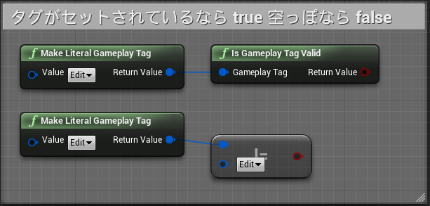
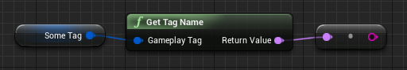
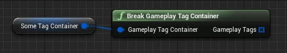
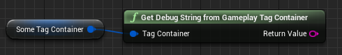

# 12日目: GameplayTag 型のプロパティ

> [UE4 GameplayTag Advent Calendar 2019 12日目](https://qiita.com/advent-calendar/2019/ue4-gameplaytag)  
>#UE4Study #UE4.23 #UnrealEngine #GameplayTag

## プロパティに GameplayTag を持たせる

* Actor や Object に、GameplayTag の形でいろんな情報を持たせたい。
    * この Actor はなにものか
    * どんな属性を持っているか
    * 今どのような状態か
    * 使用するエフェクトはどれか
* GameplayTag 型の変数や、GameplayTagContainer 型の変数を、必要なだけ作る。
* GameplayTag はただの型なので、GameplayTag の Array や、GameplayTag をキーもしくは値にとる Map(Dictionary) などももちろん使えるよ。

## GameplayTag 型のプロパティ

* セットできるのは、一度に1つのタグのみ。
* GameplayTag 変数にタグが入っているかどうかは、Is Gameplay Tag Valid ノードを使う。  
もしくは、空のタグと比較してもOK (`==`, `!=`) 。  

* ToString はない。Get Tag Name で Name 型の値が取れるので、そこから ToString する。  

## GameplayTagContainer 型のプロパティ

* 同時にたくさんのタグを持てる。
* 「特定の」タグを追加したり、「特定の」タグを削除したりできる。
    * タグを削除するには、削除したい具体的なタグを必ず知っている必要がある。
    * 「あるタグの子孫タグを全部削除」みたいなことはできない！
    * 例えば、「`Item` と指定して削除したら、`Item.AddHP.Low` とか `Item.SpeedUp` とかを全部削除」はできない。
* GameplayTagContainer 型のままでは、保持するタグを直接知ることはできない。
    * 「このタグ持ってる？」は調べられるけど、「具体的にどんなタグ持ってる？」は直接は調べられない。
    * 「`Item` 以下のタグ持ってる？」は調べられるけど、「`Item` 以下のタグいくつある？」は直接は調べられない。
    * 知るためには、Break GameplayTag Container ノードを使って、GameplayTag の配列を取得する必要がある。  
    
    * GameplayTagContainer は内部で配列としてタグ情報を持っている。その「コピー」を取得することになる。
    * 何度も何度も配列化が必要になる場合は、GameplayTag Array 型のプロパティにしておく方が使い勝手がいいかもしれない。
* デバッグ目的で、保持するタグ一覧を文字列として出力することは可能。Get Debug String from Gameplay Tag Container ノード(長い)。  

* カンマ区切りのタグ一覧文字列を取得できる。PrintString するとこんな感じ。  

## 次回予告

* [13日目: Switch と GameplayTagAssetInterface](./Day13-SwitchAndGameplayTagAssetInterface.md)

---

> [UE4 GameplayTag Advent Calendar 2019(Qiita)](https://qiita.com/advent-calendar/2019/ue4-gameplaytag)  
> [inks.blue > UE4 GameplayTag Advent Calendar 2019](./Index.md)  
> [inks.blue](../../)

(C) 2019 inks.blue
