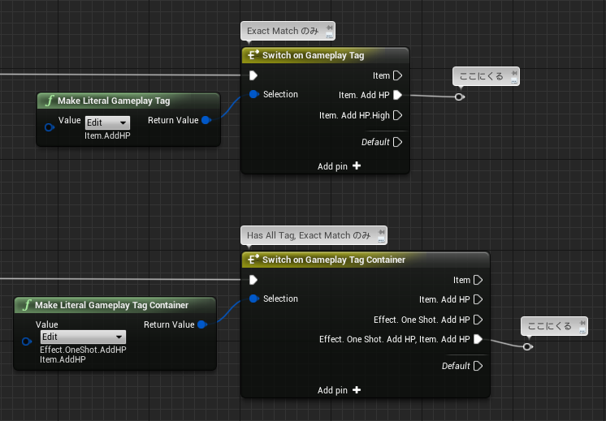
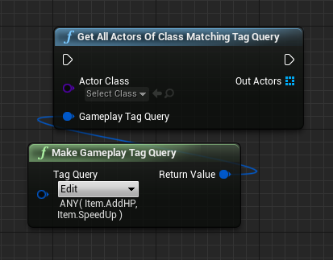
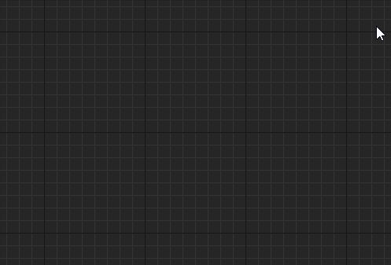
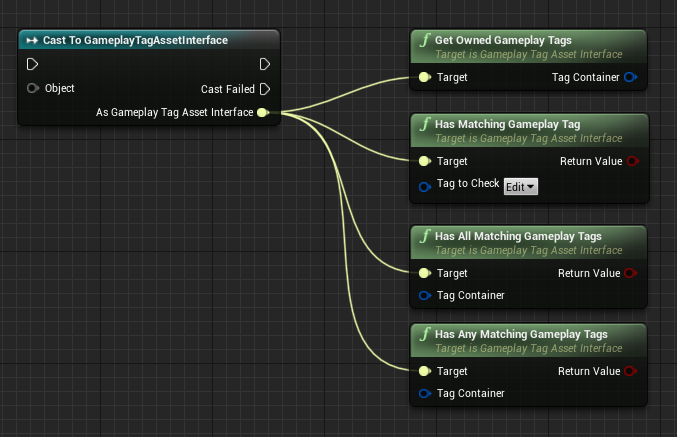
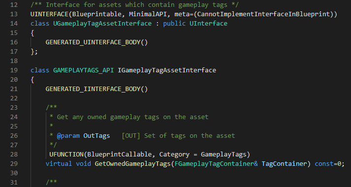
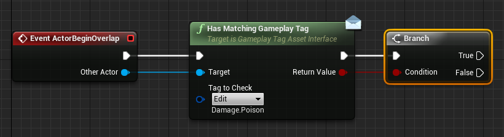

# 13日目: Switch と GameplayTagAssetInterface

> [UE4 GameplayTag Advent Calendar 2019 13日目](https://qiita.com/advent-calendar/2019/ue4-gameplaytag)  
>#UE4Study #UE4.23 #UnrealEngine #GameplayTag

# Switch on GameplayTag, GameplayTagContainer

* Switch on Gameplay Tag ノードと、Switch on Gameplay Tag Container ノードがある。
* いずれも、"Exact Match" な条件のところにのみ、処理が流れる。
* Switch on Gameplay Tag Container では、Container に含まれるタグすべてが一致する条件のところに処理が流れる。  
つまり、"Has All (Exact Match == true)" で分岐する。

# 特定のタグ条件を満たす Actor を見つけたい

* [2日目](./Day02-VsActorOrComponentTags.md) に紹介したような、Get All～ 系のノードは、GameplayTagQuery を使うものだけが用意されている:  

* この Get All Actors Of Class Matching Tag Query を使って調べられるのは、IGameplayTagAssetInterface を実装している Actor のみっぽい。
* ん？IGameplayTagAssetInterface…？  

# (I)GameplayTagAssetInterface

* GameplayTagAssetInterface なら見たような。以下の関数がある。  

* エンジンのソースコードを見てみると…  

* "CannotImplementInterfaceInBlueprint" ！！Blueprint 上ではインタフェース実装させないぜ！！
* というか、UGameplayTagAssetInterface と、IGameplayTagAssetInterface があるな。
* 理屈はまだ調べられてないけど、状況から察するに、Blueprint 上では IGameplayTagAssetInterface が UGameplayTagAssetInterface として見えるようになってるのかな。
* というわけで、Blueprint only で実装する Actor では、Get All Actors Of Class Matching Tag Query ノードは使えない。
* まあ、そんなに Get All Actors しないけどさ…

# Actor が保持する GameplayTag 情報を取得する

* というわけで、Blueprint only で実装する Actor では、GameplayTagAssetInterface が実装できない。
* Get All Actors～ はもちろん、例えばこういう処理でも対象 Actor にならない。  

* ので、具体的な型にキャストして直接プロパティを調べるか、独自のインタフェースを作成し、それを実装する必要がある。
* 汎用的なインタフェースにするなら、GameplayTagAssetInterface を参考にするとよさそう。

## 次回予告

* [14日目: GameplayTag と文字列を相互に変換する](./Day14-ConvertFromOrToString.md)

---

> [UE4 GameplayTag Advent Calendar 2019(Qiita)](https://qiita.com/advent-calendar/2019/ue4-gameplaytag)  
> [inks.blue > UE4 GameplayTag Advent Calendar 2019](./Index.md)  
> [inks.blue](../../)

(C) 2019 inks.blue
