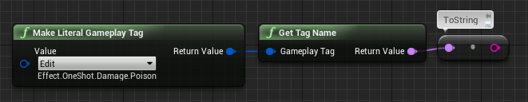
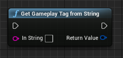

# 14日目: GameplayTag と文字列を相互に変換する

> [UE4 GameplayTag Advent Calendar 2019 14日目](https://qiita.com/advent-calendar/2019/ue4-gameplaytag)  
>#UE4Study #UE4.23 #UnrealEngine #GameplayTag

# GameplayTag → String

* Get Tag Name ノードを使うと、Name 型の文字列に変換できる。
* そこから To String すれば、String 型の文字列も取得できる。  


# String → GameplayTag

* Blueprint 上では、文字列を GameplayTag に変換する方法はない。残念。
* C++ で FGameplayTag::RequestGameplayTag() 関数をラップしてバインドすると、Blueprint からも使えるようになる。
```
FGameplayTag UGameplayTagFunctionLibrary::GetGameplayTagFromString(const FString& InString)
{
	const bool ErrorIfNotFound = false;
	
	// ErrorIfNotFound = false の場合、GameplayTag が見つからなければ、空タグを返す。
    //                   true の場合、GameplayTag が見つからなければ、実行時エラーになる。
	return FGameplayTag::RequestGameplayTag(FName(*InString), ErrorIfNotFound);
}
```


## 次回予告

* 15日目: AssetUserTag: アセットに GameplayTag 情報を付加してみる

---

> [UE4 GameplayTag Advent Calendar 2019(Qiita)](https://qiita.com/advent-calendar/2019/ue4-gameplaytag)  
> [inks.blue > UE4 GameplayTag Advent Calendar 2019](./Index.md)  
> [inks.blue](../../)

(C) 2019 inks.blue
