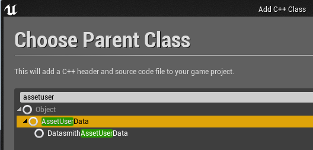
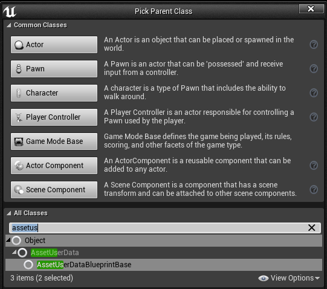
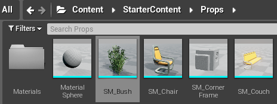
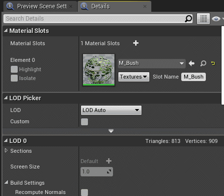
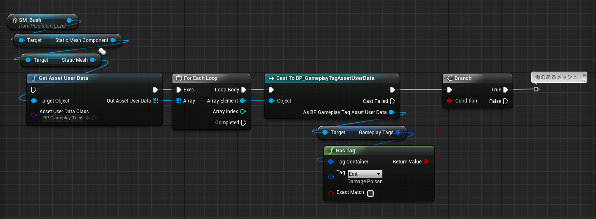

# 15日目: AssetUserData: アセットに GameplayTag 情報を付加してみる

> [UE4 GameplayTag Advent Calendar 2019 15日目](https://qiita.com/advent-calendar/2019/ue4-gameplaytag)  
>#UE4Study #UE4.23 #UnrealEngine #GameplayTag

# アセットにも、GameplayTag 情報をつけたい！

* [AssetUserData について、詳しくはこちらを参照。](http://historia.co.jp/archives/8632/)
* というわけで、Mesh とか Texture とかに、Actor のプロパティみたいなのを持たせることができる。
* 「この壁は破壊できる壁」「このドアは引き戸タイプ、こっちは開くタイプ」とか。
* Mesh や Texture への情報付加そのものは、エディタ上でできる。
* が、付加する情報の定義は、残念ながら C++ が絡む。

# 付加する情報を定義する

* 付加する情報を保持するクラスは、AssetUserData (UAssetUserData) を継承する必要がある。
* そのままだと、Blueprint 上では継承できないため、いったん C++ で継承したクラスを作り、Blueprint に公開する。
* C++ クラスを追加 → 親クラスに、AssetUserData を指定して作成。  

* UCLASS に Blueprintable を追加して、コンパイル。
* Blueprint クラスを追加 → 親クラスに、先ほど作成したクラスを指定して作成。  

* 作成した Blueprint クラスに、GameplayTag 型、もしくは GameplayTagContainer 型の変数を追加して、コンパイルする。
* これで、アセットに GameplayTag 型の情報を持たせる準備ができた。

# アセットに情報を付加する

* 試しに、Static Mesh に、AssetUserData を持たせてみる。
* StarterContent の SM_Bush を開く。  

* Asset User Data プロパティに先ほど作成したクラスを指定する。追加した変数がプロパティとして現れるので、設定する。  
  
* この茂み、毒ダメージあり。

# アセットから情報を取り出す

* アセットから AssetUserData の情報を取り出すのも、C++ で関数を作って、Blueprint に公開する。
[このやり方も、最初に紹介したこちらを参照。](http://historia.co.jp/archives/8632/)
* できた関数に、Static Mesh アクター…ではなく、保持する Static Mesh Component…でもなく、Static Mesh オブジェクトを渡す。
AssetUserData 情報を付加したのは、Static Mesh なので。

* AssetUserData 継承クラスを通じて、GameplayTag 情報を取り出す。

## 次回予告

* 16日目: FGameplayTag, FGameplayTagContainer の中身はどうなってるの？

---

> [UE4 GameplayTag Advent Calendar 2019(Qiita)](https://qiita.com/advent-calendar/2019/ue4-gameplaytag)  
> [inks.blue > UE4 GameplayTag Advent Calendar 2019](./Index.md)  
> [inks.blue](../../)

(C) 2019 inks.blue
